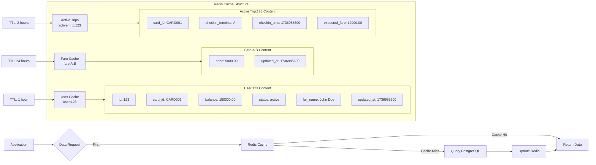
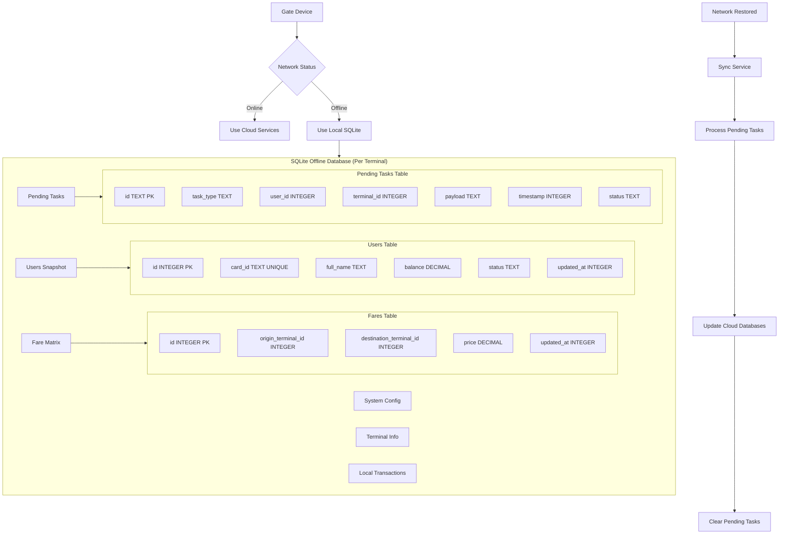

# System Design Test
## Soal

Database Design Test
Gambarkan rancangan database anda (lebih detail lebih baik) sesuai dengan analisa
sistem pada point test System Design Test. sesuai dengan Intruksi instruksi.


# Database Design E-Ticketing System - Microservice Architecture

**Database per Service untuk Sistem E-Ticketing Transportasi Publik**

----------

## 1. Microservice Database Mapping

## 🏗️ Database Architecture Diagram
```mermaid

```

## 📊 Data Flow Diagram
```mermaid
flowchart TD
    %% ==================== ONLINE FLOW ====================
    subgraph OnlineFlow["Online Operation Flow"]
        A[User Tap at Gate] --> B{Network Available?}
        B -- Yes --> C[Online Processing]
        
        subgraph C[Online Processing]
            C1[Gate Device] --> C2[Istio Ingress]
            C2 --> C3[Ticketing Service]
            C3 --> C4{Data Priority Check}
            
            C4 -- First --> C5[Redis Cache]
            C4 -- Second --> C6[PostgreSQL]
            C4 -- Fallback --> C7[SQLite]
            
            C5 --> C8[User Validation]
            C6 --> C8
            C7 --> C8
            
            C8 --> C9{Validation Passed?}
            C9 -- Yes --> C10[Open Gate]
            C9 -- No --> C11[Keep Gate Closed]
            
            C10 --> C12[Publish to Message Broker]
            C11 --> C13[Display Error Message]
        end
        
        C12 --> D[Async Processing]
        
        subgraph D[Async Processing]
            D1[Fare Service]
            D2[Notification Service]
            D3[Journey Service]
            D4[Analytics Service]
            D5[Sync Service]
        end
    end

    %% ==================== OFFLINE FLOW ====================
    subgraph OfflineFlow["Offline Operation Flow"]
        E[User Tap at Gate] --> F{Network Available?}
        F -- No --> G[Offline Processing]
        
        subgraph G[Offline Processing]
            G1[Gate Device] --> G2[Local SQLite Processing]
            G2 --> G3[Local Validation]
            G3 --> G4{Validation Passed?}
            G4 -- Yes --> G5[Open Gate]
            G4 -- No --> G6[Keep Gate Closed]
            
            G5 --> G7[Create Pending Tasks]
            G6 --> G8[Display Offline Error]
        end
    end

    %% ==================== RECONCILIATION FLOW ====================
    subgraph ReconciliationFlow["Reconciliation Flow"]
        H[Network Restored] --> I[Sync Service]
        I --> J[Process Pending Tasks]
        J --> K[Batch Reconciliation]
        K --> L[Update All Services]
        L --> M[Clear Pending Tasks]
    end

    %% ==================== FAIL-SAFE MECHANISM ====================
    subgraph FailSafeFlow["Fail-Safe Mechanism"]
        N[Scheduled Job] --> O[Check for Expired Holds]
        O --> P{Auto-Release Needed?}
        P -- Yes --> Q[Release Hold Amount]
        P -- No --> R[Skip]
        
        Q --> S[Update Balance]
        S --> T[Send Notification]
        
        U[Daily Cleanup] --> V[Find Orphaned Journeys]
        V --> W[Mark as Expired]
        W --> X[Clear User Trip Status]
    end

    %% ==================== CONNECTIONS BETWEEN FLOWS ====================
    G7 -.-> H
    C12 -.-> D
```
## 🔄 Redis Caching Strategy

----------

## 📱 SQLite Offline Structure


## 2. Service-Specific Database Schemas

### 2.1 User Service Database

**Purpose:** Mengelola data user, card, balance, dan status **Database:** PostgreSQL - `user_service_db`

```sql
-- Users table
CREATE TYPE user_status_enum AS ENUM ('active', 'blocked', 'suspended');

CREATE TABLE users (
    id BIGSERIAL PRIMARY KEY,
    card_id VARCHAR(50) UNIQUE NOT NULL,
    full_name VARCHAR(255) NOT NULL,
    email VARCHAR(255),
    phone VARCHAR(20),
    balance DECIMAL(15,2) NOT NULL DEFAULT 0.00,
    status user_status_enum NOT NULL DEFAULT 'active',
    current_trip_terminal_id INTEGER, -- Reference to terminal (cross-service)
    registered_at TIMESTAMP WITH TIME ZONE DEFAULT CURRENT_TIMESTAMP,
    updated_at TIMESTAMP WITH TIME ZONE DEFAULT CURRENT_TIMESTAMP,

    CONSTRAINT check_card_id_format CHECK (card_id ~ '^[A-Z0-9]{8,20}$')
);

-- Indexes
CREATE INDEX idx_users_card_id ON users(card_id);
CREATE INDEX idx_users_status ON users(status);
```

### 2.2 Terminal & Fare Service Database

**Purpose:** Mengelola terminal, gate, dan fare matrix **Database:** PostgreSQL - `terminal_service_db`

```sql
-- =====================================================
-- ENUM TYPES
-- =====================================================

CREATE TYPE gate_type_enum AS ENUM ('entry', 'exit', 'bidirectional');
CREATE TYPE gate_status_enum AS ENUM ('online', 'offline', 'maintenance', 'error');
CREATE TYPE hold_status_enum AS ENUM ('held', 'charged', 'released');

-- =====================================================
-- MAIN TABLES
-- =====================================================

-- Terminals master data
CREATE TABLE terminals (
    id SERIAL PRIMARY KEY,
    name VARCHAR(100) NOT NULL,
    code VARCHAR(10) UNIQUE NOT NULL,
    location TEXT,
    latitude DECIMAL(10,8),
    longitude DECIMAL(11,8),
    is_active BOOLEAN DEFAULT true,
    created_at TIMESTAMP WITH TIME ZONE DEFAULT CURRENT_TIMESTAMP,
    updated_at TIMESTAMP WITH TIME ZONE DEFAULT CURRENT_TIMESTAMP,
    
    CONSTRAINT check_terminal_code CHECK (code ~ '^[A-Z]{1,3}$')
);

-- Gates per terminal
CREATE TABLE gates (
    id BIGSERIAL PRIMARY KEY,
    terminal_id INTEGER NOT NULL REFERENCES terminals(id) ON DELETE CASCADE,
    gate_code VARCHAR(20) NOT NULL,
    gate_type gate_type_enum NOT NULL,
    status gate_status_enum NOT NULL DEFAULT 'online',
    last_heartbeat TIMESTAMP WITH TIME ZONE DEFAULT CURRENT_TIMESTAMP,
    created_at TIMESTAMP WITH TIME ZONE DEFAULT CURRENT_TIMESTAMP,
    updated_at TIMESTAMP WITH TIME ZONE DEFAULT CURRENT_TIMESTAMP,
    
    CONSTRAINT unique_gate_per_terminal UNIQUE(terminal_id, gate_code)
);

-- Fare matrix
CREATE TABLE fares (
    id BIGSERIAL PRIMARY KEY,
    origin_terminal_id INTEGER NOT NULL REFERENCES terminals(id) ON DELETE CASCADE,
    destination_terminal_id INTEGER NOT NULL REFERENCES terminals(id) ON DELETE CASCADE,
    price DECIMAL(10,2) NOT NULL,
    is_active BOOLEAN DEFAULT true,
    effective_from TIMESTAMP WITH TIME ZONE DEFAULT CURRENT_TIMESTAMP,
    effective_until TIMESTAMP WITH TIME ZONE,
    created_at TIMESTAMP WITH TIME ZONE DEFAULT CURRENT_TIMESTAMP,
    updated_at TIMESTAMP WITH TIME ZONE DEFAULT CURRENT_TIMESTAMP,
    
    CONSTRAINT check_price_positive CHECK (price >= 0),
    CONSTRAINT check_different_terminals CHECK (origin_terminal_id != destination_terminal_id)
);

-- Balance holds for transaction processing
CREATE TABLE balance_holds (
    id BIGSERIAL PRIMARY KEY,
    user_id BIGINT NOT NULL,
    terminal_id INTEGER NOT NULL REFERENCES terminals(id),
    hold_amount DECIMAL(15,2) NOT NULL,
    final_amount DECIMAL(15,2),
    status hold_status_enum NOT NULL DEFAULT 'held',
    transaction_reference VARCHAR(100) UNIQUE,
    hold_reason VARCHAR(255) DEFAULT 'Trip fare hold',
    expires_at TIMESTAMP WITH TIME ZONE DEFAULT (CURRENT_TIMESTAMP + INTERVAL '30 minutes'),
    created_at TIMESTAMP WITH TIME ZONE DEFAULT CURRENT_TIMESTAMP,
    released_at TIMESTAMP WITH TIME ZONE,
    updated_at TIMESTAMP WITH TIME ZONE DEFAULT CURRENT_TIMESTAMP,
    
    CONSTRAINT check_hold_amount_positive CHECK (hold_amount > 0),
    CONSTRAINT check_final_amount_positive CHECK (final_amount IS NULL OR final_amount >= 0)
);

-- =====================================================
-- INDEXES (DIPERBAIKI)
-- =====================================================

-- Terminal indexes
CREATE INDEX idx_terminals_active ON terminals(is_active);
CREATE INDEX idx_terminals_code ON terminals(code);

-- Gate indexes
CREATE INDEX idx_gates_terminal_status ON gates(terminal_id, status);
CREATE INDEX idx_gates_heartbeat ON gates(last_heartbeat) WHERE status = 'online';

-- Fare indexes
CREATE INDEX idx_fares_route ON fares(origin_terminal_id, destination_terminal_id);
CREATE INDEX idx_fares_active ON fares(is_active) WHERE is_active = true;
CREATE INDEX idx_fares_dates ON fares(effective_from, effective_until);

-- Balance hold indexes
CREATE INDEX idx_balance_holds_user_status ON balance_holds(user_id, status);
CREATE INDEX idx_balance_holds_terminal ON balance_holds(terminal_id, status);
CREATE INDEX idx_balance_holds_expires ON balance_holds(expires_at) WHERE status = 'held';
CREATE INDEX idx_balance_holds_transaction_ref ON balance_holds(transaction_reference);

-- =====================================================
-- SAMPLE DATA (DIPERBAIKI)
-- =====================================================

-- Insert terminals
INSERT INTO terminals (name, code, location, latitude, longitude) VALUES 
('Terminal Utara', 'A', 'Jl. Raya Utara No.1', -7.250445, 112.768845),
('Terminal Selatan', 'B', 'Jl. Raya Selatan No.2', -7.265445, 112.768845),
('Terminal Timur', 'C', 'Jl. Raya Timur No.3', -7.257445, 112.778845),
('Terminal Barat', 'D', 'Jl. Raya Barat No.4', -7.257445, 112.758845),
('Terminal Pusat', 'E', 'Jl. Raya Pusat No.5', -7.257445, 112.768845);

-- Insert gates
INSERT INTO gates (terminal_id, gate_code, gate_type, status) VALUES
(1, 'A-ENTRY-01', 'entry', 'online'),
(1, 'A-EXIT-01', 'exit', 'online'),
(1, 'A-BI-01', 'bidirectional', 'maintenance'),
(2, 'B-ENTRY-01', 'entry', 'online'),
(2, 'B-EXIT-01', 'exit', 'online'),
(3, 'C-ENTRY-01', 'entry', 'online'),
(3, 'C-EXIT-01', 'exit', 'offline'),
(4, 'D-BI-01', 'bidirectional', 'online'),
(5, 'E-ENTRY-01', 'entry', 'online'),
(5, 'E-EXIT-01', 'exit', 'online');

-- Insert fare matrix data
INSERT INTO fares (origin_terminal_id, destination_terminal_id, price) VALUES
-- From Terminal A (Utara)
(1, 2, 5000.00), (1, 3, 7000.00), (1, 4, 9000.00), (1, 5, 12000.00),
-- From Terminal B (Selatan)
(2, 1, 5000.00), (2, 3, 6000.00), (2, 4, 8000.00), (2, 5, 11000.00),
-- From Terminal C (Timur)
(3, 1, 7000.00), (3, 2, 6000.00), (3, 4, 7000.00), (3, 5, 10000.00),
-- From Terminal D (Barat)
(4, 1, 9000.00), (4, 2, 8000.00), (4, 3, 7000.00), (4, 5, 9000.00),
-- From Terminal E (Pusat)
(5, 1, 12000.00), (5, 2, 11000.00), (5, 3, 10000.00), (5, 4, 9000.00);

-- Insert sample balance holds (DIPERBAIKI - konsisten)
INSERT INTO balance_holds (user_id, terminal_id, hold_amount, final_amount, status, transaction_reference, hold_reason, expires_at, released_at) VALUES
-- Active holds (released_at NULL, final_amount NULL)
(1, 1, 12000.00, NULL, 'held', 'TXN-2024-001', 'Trip from Terminal A to Terminal E', CURRENT_TIMESTAMP + INTERVAL '25 minutes', NULL),
(2, 3, 7000.00, NULL, 'held', 'TXN-2024-002', 'Trip from Terminal C to Terminal A', CURRENT_TIMESTAMP + INTERVAL '20 minutes', NULL),
(3, 2, 8000.00, NULL, 'held', 'TXN-2024-003', 'Trip from Terminal B to Terminal D', CURRENT_TIMESTAMP + INTERVAL '15 minutes', NULL),

-- Completed transactions (released_at diisi, final_amount diisi)
(4, 1, 5000.00, 5000.00, 'charged', 'TXN-2024-004', 'Trip from Terminal A to Terminal B', CURRENT_TIMESTAMP - INTERVAL '2 hours', CURRENT_TIMESTAMP - INTERVAL '1 hour 30 minutes'),
(5, 4, 9000.00, 9000.00, 'charged', 'TXN-2024-005', 'Trip from Terminal D to Terminal E', CURRENT_TIMESTAMP - INTERVAL '3 hours', CURRENT_TIMESTAMP - INTERVAL '2 hours 45 minutes'),
(1, 2, 6000.00, 6000.00, 'charged', 'TXN-2024-006', 'Trip from Terminal B to Terminal C', CURRENT_TIMESTAMP - INTERVAL '1 day', CURRENT_TIMESTAMP - INTERVAL '23 hours'),

-- Released holds (released_at diisi, final_amount NULL)
(2, 5, 10000.00, NULL, 'released', 'TXN-2024-007', 'Trip from Terminal E to Terminal C - Cancelled', CURRENT_TIMESTAMP - INTERVAL '4 hours', CURRENT_TIMESTAMP - INTERVAL '3 hours 55 minutes'),
(3, 1, 7000.00, NULL, 'released', 'TXN-2024-008', 'Trip from Terminal A to Terminal C - Gate error', CURRENT_TIMESTAMP - INTERVAL '6 hours', CURRENT_TIMESTAMP - INTERVAL '5 hours 50 minutes');


```

### 2.3 Journey Service Database

**Purpose:** Mengelola history perjalanan dan active trip **Database:** PostgreSQL - `journey_service_db`

```sql
-- Journey history
CREATE TYPE journey_status_enum AS ENUM ('active', 'completed', 'cancelled', 'abandoned');

CREATE TABLE journey_history (
    id BIGSERIAL PRIMARY KEY,
    user_id BIGINT NOT NULL, -- External reference
    checkin_terminal_id INTEGER NOT NULL, -- External reference
    checkout_terminal_id INTEGER, -- External reference
    checkin_time TIMESTAMP WITH TIME ZONE NOT NULL,
    checkout_time TIMESTAMP WITH TIME ZONE,
    fare_charged DECIMAL(10,2),
    journey_duration_minutes INTEGER,
    status journey_status_enum NOT NULL DEFAULT 'active',
    metadata JSONB,
    
    CONSTRAINT check_checkout_after_checkin 
        CHECK (checkout_time IS NULL OR checkout_time > checkin_time)
);


-- Duration calculation trigger
CREATE OR REPLACE FUNCTION calculate_journey_duration()
RETURNS TRIGGER AS $$
BEGIN
    IF NEW.checkout_time IS NOT NULL AND NEW.checkin_time IS NOT NULL THEN
        NEW.journey_duration_minutes := CEIL(EXTRACT(EPOCH FROM (NEW.checkout_time - NEW.checkin_time)) / 60);
    ELSE
        NEW.journey_duration_minutes := NULL;
    END IF;

    RETURN NEW;
END;
$$ LANGUAGE plpgsql;


-- Indexes
CREATE INDEX idx_journey_user_status ON journey_history(user_id, status);
CREATE INDEX idx_journey_terminals ON journey_history(checkin_terminal_id, checkout_terminal_id);
CREATE INDEX idx_journey_date ON journey_history(checkin_time DESC);

```

### 2.4 Notification Service Database

**Purpose:** Mengelola notifikasi untuk user **Database:** PostgreSQL - `notification_service_db`

```sql
CREATE TYPE notification_type_enum AS ENUM ('checkin', 'checkout', 'fare_update');
CREATE TYPE notification_status_enum AS ENUM ('pending', 'sent', 'failed');

-- =====================================================
-- MAIN TABLES
-- =====================================================

-- Notifications table (sesuai task requirement)
CREATE TABLE notifications (
    id BIGSERIAL PRIMARY KEY,
    user_id BIGINT NOT NULL REFERENCES users(id) ON DELETE CASCADE,
    type notification_type_enum NOT NULL,
    status notification_status_enum NOT NULL DEFAULT 'pending',
    message TEXT NOT NULL, -- isi notifikasi lengkap
    created_at TIMESTAMP WITH TIME ZONE DEFAULT CURRENT_TIMESTAMP,
    sent_at TIMESTAMP WITH TIME ZONE,
    
    -- Optional metadata untuk tracking
    terminal_id INTEGER REFERENCES terminals(id),
    transaction_reference VARCHAR(100),
    metadata JSONB -- untuk data tambahan seperti held_amount, fare, etc
);

-- =====================================================
-- INDEXES
-- =====================================================

CREATE INDEX idx_notifications_user_status ON notifications(user_id, status);
CREATE INDEX idx_notifications_created ON notifications(created_at DESC);
CREATE INDEX idx_notifications_pending ON notifications(status) WHERE status = 'pending';
CREATE INDEX idx_notifications_type ON notifications(type);

-- =====================================================
-- SAMPLE DATA
-- =====================================================

INSERT INTO notifications (user_id, type, status, message, terminal_id, transaction_reference, metadata, sent_at) VALUES
-- Check-in notifications
(1, 'checkin', 'sent', 
 'Anda check-in di Terminal Utara pada 08:30. Saldo ditahan sementara Rp 12.000. Saldo akan disesuaikan saat check-out berdasarkan tujuan akhir.', 
 1, 'TXN-2024-001', 
 '{"held_amount": 12000, "checkin_time": "08:30", "terminal_name": "Terminal Utara"}',
 CURRENT_TIMESTAMP - INTERVAL '2 hours'),

(2, 'checkin', 'sent', 
 'Anda check-in di Terminal Timur pada 09:15. Saldo ditahan sementara Rp 7.000. Saldo akan disesuaikan saat check-out berdasarkan tujuan akhir.', 
 3, 'TXN-2024-002', 
 '{"held_amount": 7000, "checkin_time": "09:15", "terminal_name": "Terminal Timur"}',
 CURRENT_TIMESTAMP - INTERVAL '1 hour'),

-- Check-out notifications  
(1, 'checkout', 'sent', 
 'Perjalanan selesai dari Terminal Utara ke Terminal Pusat. Tarif: Rp 12.000. Sisa saldo: Rp 138.000.', 
 5, 'TXN-2024-001', 
 '{"origin": "Terminal Utara", "destination": "Terminal Pusat", "fare": 12000, "remaining_balance": 138000}',
 CURRENT_TIMESTAMP - INTERVAL '30 minutes'),

(4, 'checkout', 'sent', 
 'Perjalanan selesai dari Terminal Utara ke Terminal Selatan. Tarif: Rp 5.000. Sisa saldo: Rp 45.000.', 
 2, 'TXN-2024-004', 
 '{"origin": "Terminal Utara", "destination": "Terminal Selatan", "fare": 5000, "remaining_balance": 45000}',
 CURRENT_TIMESTAMP - INTERVAL '3 hours'),

-- Fare update notifications
(3, 'fare_update', 'sent', 
 'Informasi: Tarif perjalanan Terminal Barat ke Terminal Pusat telah diperbarui menjadi Rp 9.500 efektif besok.', 
 NULL, NULL, 
 '{"route": "Terminal Barat - Terminal Pusat", "new_fare": 9500, "effective_date": "2024-12-17"}',
 CURRENT_TIMESTAMP - INTERVAL '1 day'),

-- Pending notifications (belum terkirim)
(3, 'checkin', 'pending', 
 'Anda check-in di Terminal Selatan pada 14:20. Saldo ditahan sementara Rp 8.000. Saldo akan disesuaikan saat check-out berdasarkan tujuan akhir.', 
 2, 'TXN-2024-003', 
 '{"held_amount": 8000, "checkin_time": "14:20", "terminal_name": "Terminal Selatan"}',
 NULL),

-- Failed notifications
(5, 'checkin', 'failed', 
 'Anda check-in di Terminal Barat pada 10:45. Saldo ditahan sementara Rp 9.000. Saldo akan disesuaikan saat check-out berdasarkan tujuan akhir.', 
 4, 'TXN-2024-005', 
 '{"held_amount": 9000, "checkin_time": "10:45", "terminal_name": "Terminal Barat", "error": "Email delivery failed"}',
 NULL);
```

### 2.5 Analytics Service Database

**Purpose:** Mengelola data analytics dan reporting **Database:** PostgreSQL - `analytics_service_db`

```sql
-- =====================================================
-- ENUM TYPES
-- =====================================================

CREATE TYPE event_type_enum AS ENUM ('checkin', 'checkout', 'fare_update');

-- =====================================================
-- MAIN TABLES
-- =====================================================

-- Analytics events table (sesuai task requirement)
CREATE TABLE analytics_events (
    id BIGSERIAL PRIMARY KEY,
    event_type event_type_enum NOT NULL,
    terminal_id INTEGER REFERENCES terminals(id),
    user_id BIGINT REFERENCES users(id), -- nullable untuk anonymous tracking
    user_demographics JSONB,
    event_timestamp TIMESTAMP WITH TIME ZONE NOT NULL,
    created_at TIMESTAMP WITH TIME ZONE DEFAULT CURRENT_TIMESTAMP
) PARTITION BY RANGE (event_timestamp);

-- =====================================================
-- TABLE PARTITIONS (for performance)
-- =====================================================

-- Monthly partitions for better performance
CREATE TABLE analytics_events_2024_01 PARTITION OF analytics_events 
    FOR VALUES FROM ('2024-01-01') TO ('2024-02-01');
CREATE TABLE analytics_events_2024_02 PARTITION OF analytics_events 
    FOR VALUES FROM ('2024-02-01') TO ('2024-03-01');
CREATE TABLE analytics_events_2024_03 PARTITION OF analytics_events 
    FOR VALUES FROM ('2024-03-01') TO ('2024-04-01');
CREATE TABLE analytics_events_2024_04 PARTITION OF analytics_events 
    FOR VALUES FROM ('2024-04-01') TO ('2024-05-01');
CREATE TABLE analytics_events_2024_12 PARTITION OF analytics_events 
    FOR VALUES FROM ('2024-12-01') TO ('2025-01-01');

-- =====================================================
-- AGGREGATED METRICS TABLE
-- =====================================================

-- Pre-computed daily metrics for dashboard/BI
CREATE TABLE daily_terminal_metrics (
    metric_date DATE NOT NULL,
    terminal_id INTEGER NOT NULL REFERENCES terminals(id),
    total_checkins INTEGER DEFAULT 0,
    total_checkouts INTEGER DEFAULT 0,
    unique_users INTEGER DEFAULT 0,
    peak_hour INTEGER, -- jam paling sibuk (0-23)
    busiest_hour_count INTEGER, -- jumlah event di jam tersibuk
    created_at TIMESTAMP WITH TIME ZONE DEFAULT CURRENT_TIMESTAMP,
    updated_at TIMESTAMP WITH TIME ZONE DEFAULT CURRENT_TIMESTAMP,
    
    PRIMARY KEY(metric_date, terminal_id)
);

-- =====================================================
-- INDEXES
-- =====================================================

-- Analytics events indexes
CREATE INDEX idx_analytics_event_type ON analytics_events(event_type, event_timestamp);
CREATE INDEX idx_analytics_terminal ON analytics_events(terminal_id, event_timestamp);
CREATE INDEX idx_analytics_user ON analytics_events(user_id, event_timestamp) WHERE user_id IS NOT NULL;
CREATE INDEX idx_analytics_demographics ON analytics_events USING GIN(user_demographics);

-- Daily metrics indexes
CREATE INDEX idx_daily_metrics_terminal ON daily_terminal_metrics(terminal_id, metric_date DESC);
CREATE INDEX idx_daily_metrics_date ON daily_terminal_metrics(metric_date DESC);

-- =====================================================
-- SAMPLE DATA
-- =====================================================

-- Sample analytics events
INSERT INTO analytics_events (event_type, terminal_id, user_id, user_demographics, event_timestamp) VALUES
-- Check-in events
('checkin', 1, 1, '{"age_group": "25-34", "gender": "male", "membership": "gold"}', '2024-01-15 08:30:00+07'),
('checkin', 1, 2, '{"age_group": "18-24", "gender": "female", "membership": "silver"}', '2024-01-15 08:45:00+07'),
('checkin', 2, 3, '{"age_group": "35-44", "gender": "male", "membership": "regular"}', '2024-01-15 09:00:00+07'),
('checkin', 3, 4, '{"age_group": "25-34", "gender": "female", "membership": "gold"}', '2024-01-15 09:15:00+07'),
('checkin', 1, 5, '{"age_group": "45-54", "gender": "male", "membership": "premium"}', '2024-01-15 17:30:00+07'),

-- Check-out events  
('checkout', 5, 1, '{"age_group": "25-34", "gender": "male", "membership": "gold"}', '2024-01-15 09:45:00+07'),
('checkout', 3, 2, '{"age_group": "18-24", "gender": "female", "membership": "silver"}', '2024-01-15 10:30:00+07'),
('checkout', 4, 3, '{"age_group": "35-44", "gender": "male", "membership": "regular"}', '2024-01-15 11:15:00+07'),
('checkout', 2, 4, '{"age_group": "25-34", "gender": "female", "membership": "gold"}', '2024-01-15 12:00:00+07'),

-- Fare update events (system events, no user_id)
('fare_update', NULL, NULL, NULL, '2024-01-15 06:00:00+07'),
('fare_update', NULL, NULL, NULL, '2024-01-16 06:00:00+07'),

-- More check-in events for peak analysis
('checkin', 1, NULL, '{"age_group": "25-34", "gender": "male", "membership": "regular"}', '2024-01-15 07:30:00+07'),
('checkin', 1, NULL, '{"age_group": "18-24", "gender": "female", "membership": "silver"}', '2024-01-15 07:45:00+07'),
('checkin', 1, NULL, '{"age_group": "35-44", "gender": "male", "membership": "gold"}', '2024-01-15 08:00:00+07'),
('checkin', 2, NULL, '{"age_group": "25-34", "gender": "female", "membership": "regular"}', '2024-01-15 17:00:00+07'),
('checkin', 2, NULL, '{"age_group": "45-54", "gender": "male", "membership": "premium"}', '2024-01-15 17:15:00+07'),
('checkin', 2, NULL, '{"age_group": "25-34", "gender": "female", "membership": "gold"}', '2024-01-15 17:30:00+07');

-- Sample daily metrics (pre-computed)
INSERT INTO daily_terminal_metrics (metric_date, terminal_id, total_checkins, total_checkouts, unique_users, peak_hour, busiest_hour_count) VALUES
('2024-01-15', 1, 4, 1, 3, 8, 3), -- Terminal A: peak di jam 8 pagi
('2024-01-15', 2, 3, 1, 2, 17, 3), -- Terminal B: peak di jam 5 sore  
('2024-01-15', 3, 1, 1, 1, 9, 1), -- Terminal C
('2024-01-14', 1, 5, 4, 4, 7, 2),
('2024-01-14', 2, 6, 5, 5, 18, 3),
('2024-01-13', 1, 8, 7, 6, 8, 4);
```


##  🗄️ Redis Cache Structure 

### 1️⃣ Users Cache
```bash
# Key: user:{user_id}
HSET user:123 
  "id" "123"
  "card_id" "CARD001"
  "balance" "150000.00"
  "status" "active"
  "full_name" "John Doe"
  "updated_at" "1736985600"

# TTL: 1 hour
EXPIRE user:123 3600

# Commands:
HGET user:123 balance
HSET user:123 balance "140000.00"
DEL user:123
```

### 2️⃣ Fare Matrix Cache
```bash
# Key: fare:{origin}:{destination}
HSET fare:A:B
  "price" "5000.00"
  "updated_at" "1736985600"

# TTL: 24 hours
EXPIRE fare:A:B 86400

# Commands:
HGET fare:A:B price
KEYS fare:A:*
DEL fare:A:B
```

### 3️⃣ Active Trip Lookup (Optional)
```bash
# Key: active_trip:{user_id}
HSET active_trip:123
  "card_id" "CARD001"
  "checkin_terminal" "A"
  "checkin_time" "1736985600"
  "expected_fare" "12000.00"

# TTL: 2 hours (auto-cleanup)
EXPIRE active_trip:123 7200

# Commands:
EXISTS active_trip:123
HGETALL active_trip:123
DEL active_trip:123
```

## ⚙️ Basic Redis Config
```bash
# Max memory policy
CONFIG SET maxmemory 1gb
CONFIG SET maxmemory-policy allkeys-lru

# Enable AOF persistence (optional)
CONFIG SET appendonly yes
```

## 🚀 Usage Examples
```bash
# Check user balance
HGET user:123 balance

# Get fare price
HGET fare:A:B price

# Check active trip
EXISTS active_trip:123

# Update user balance
HSET user:123 balance "135000.00"
EXPIRE user:123 3600
```

**Note:** Data di Redis bersifat sementara dan akan di-refresh secara berkala dari database utama.

## 4. Offline Database (SQLite per Terminal)

**Purpose:** Local storage untuk operasi offline **Database:** SQLite - per terminal gate

```sql
-- Local user snapshots
-- =====================================================
-- OFFLINE DATABASE (SQLITE) - PER TERMINAL
-- =====================================================

-- 1. USER SNAPSHOTS (hanya data user yang aktif/terkini)
CREATE TABLE users (
    id INTEGER PRIMARY KEY,
    card_id VARCHAR(50) UNIQUE NOT NULL,
    full_name VARCHAR(255) NOT NULL,
    email VARCHAR(255),
    phone VARCHAR(20),
    balance DECIMAL(15,2) NOT NULL DEFAULT 0.00,
    status TEXT NOT NULL DEFAULT 'active',
    current_trip_terminal_id INTEGER,
    registered_at INTEGER DEFAULT (strftime('%s', 'now')),
    updated_at INTEGER DEFAULT (strftime('%s', 'now')),
    
    CHECK (status IN ('active', 'inactive', 'suspended'))
);

-- 2. FARE MATRIX (hanya rute yang relevan dengan terminal ini)
CREATE TABLE fares (
    id INTEGER PRIMARY KEY,
    origin_terminal_id INTEGER NOT NULL,
    destination_terminal_id INTEGER NOT NULL,
    price DECIMAL(10,2) NOT NULL,
    is_active BOOLEAN DEFAULT 1,
    effective_from INTEGER DEFAULT (strftime('%s', 'now')),
    effective_until INTEGER,
    created_at INTEGER DEFAULT (strftime('%s', 'now')),
    updated_at INTEGER DEFAULT (strftime('%s', 'now')),
    
    CHECK (price >= 0),
    CHECK (origin_terminal_id != destination_terminal_id)
);

-- 3. OFFLINE PENDING TASKS (yang terjadi saat offline)
CREATE TABLE offline_tasks (
    id TEXT PRIMARY KEY,
    task_type TEXT NOT NULL,
    user_id INTEGER NOT NULL,
    terminal_id INTEGER,
    checkin_terminal_id INTEGER,
    checkout_terminal_id INTEGER,
    estimated_fare REAL,
    payload TEXT, -- JSON string
    timestamp INTEGER NOT NULL,
    status TEXT NOT NULL DEFAULT 'pending',
    attempts INTEGER DEFAULT 0,
    
    CHECK (task_type IN ('checkin','checkout')),
    CHECK (status IN ('pending','processing','processed','failed'))
);

-- 4. SYSTEM CONFIG (config yang diperlukan untuk offline operation)
CREATE TABLE system_config (
    key TEXT PRIMARY KEY,
    value TEXT NOT NULL,
    updated_at INTEGER NOT NULL
);

-- 5. TERMINAL INFO (data terminal sendiri + tetangga terdekat)
CREATE TABLE terminals (
    id INTEGER PRIMARY KEY,
    code TEXT NOT NULL,
    name TEXT NOT NULL,
    location TEXT,
    latitude REAL,
    longitude REAL
);

-- 6. LOCAL TRANSACTION LOG (audit trail untuk recovery)
CREATE TABLE local_transactions (
    id INTEGER PRIMARY KEY,
    user_id INTEGER NOT NULL,
    terminal_id INTEGER NOT NULL,
    action_type TEXT NOT NULL,
    amount REAL,
    timestamp INTEGER NOT NULL,
    reference_id TEXT,
    synced INTEGER DEFAULT 0 -- 0 = not synced, 1 = synced
);

-- =====================================================
-- INDEXES UNTUK PERFORMANCE OFFLINE
-- =====================================================

CREATE INDEX idx_users_card_id ON users(card_id);
CREATE INDEX idx_users_status ON users(status);
CREATE INDEX idx_fares_route ON fares(origin_terminal_id, destination_terminal_id);
CREATE INDEX idx_fares_active ON fares(is_active) WHERE is_active = 1;
CREATE INDEX idx_offline_tasks_status ON offline_tasks(status);
CREATE INDEX idx_offline_tasks_timestamp ON offline_tasks(timestamp);
CREATE INDEX idx_local_transactions_synced ON local_transactions(synced);
```

----------

## 5. Cross-Service Data Consistency

### 5.1 Service Communication Patterns

```sql
-- Event payload examples for inter-service communication

-- User Service → Other Services (balance update)
{
  "event_type": "user.balance.updated",
  "user_id": 123,
  "old_balance": 5000.00,
  "new_balance": 3800.00,
  "transaction_reference": "TXN-456",
  "timestamp": "2024-01-15T09:15:00Z"
}

-- Journey Service → Transaction Service (checkout request)
{
  "event_type": "journey.checkout.requested", 
  "user_id": 123,
  "journey_id": 456,
  "origin_terminal_id": 1,
  "destination_terminal_id": 5,
  "timestamp": "2024-01-15T09:15:00Z"
}

```

### 5.2 Data Synchronization Strategy

**Eventual Consistency Model:**

-   Each service owns its data
-   Cross-service references stored as IDs
-   Event-driven updates via message broker
-   Compensation patterns for failures
-   Regular reconciliation jobs

### 5.3 Backup & Recovery Per Service

```sql
-- Daily backup script example
pg_dump -h user-db-host -U user_service -d user_service_db > user_backup_$(date +%Y%m%d).sql
pg_dump -h terminal-db-host -U terminal_service -d terminal_service_db > terminal_backup_$(date +%Y%m%d).sql
pg_dump -h transaction-db-host -U transaction_service -d transaction_service_db > transaction_backup_$(date +%Y%m%d).sql

```

----------

## 6. Database Deployment per Environment

### Development

-   Single PostgreSQL instance dengan multiple databases
-   Single Redis instance
-   SQLite files lokal

### Production

-   Dedicated PostgreSQL cluster per service
-   Redis Cluster untuk HA
-   SQLite synchronized across terminal fleets
